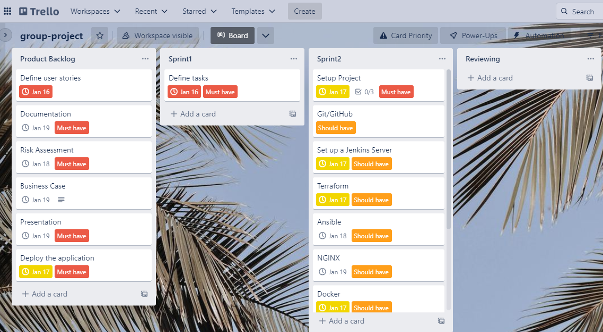
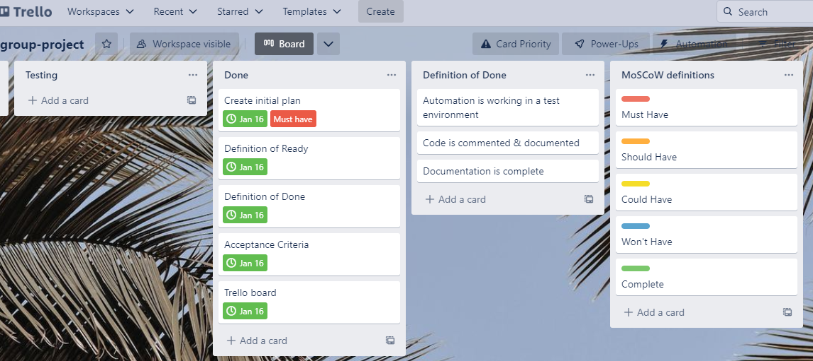
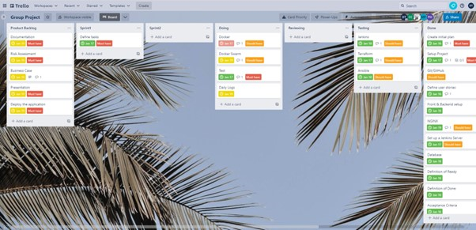
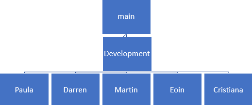
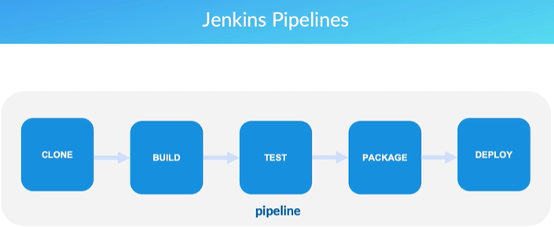
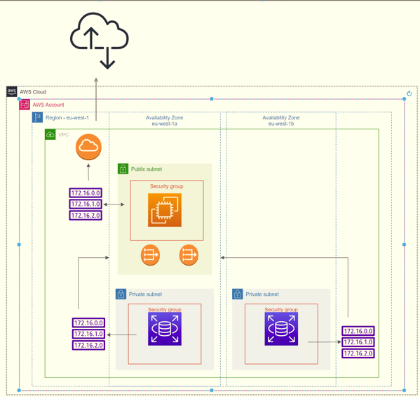
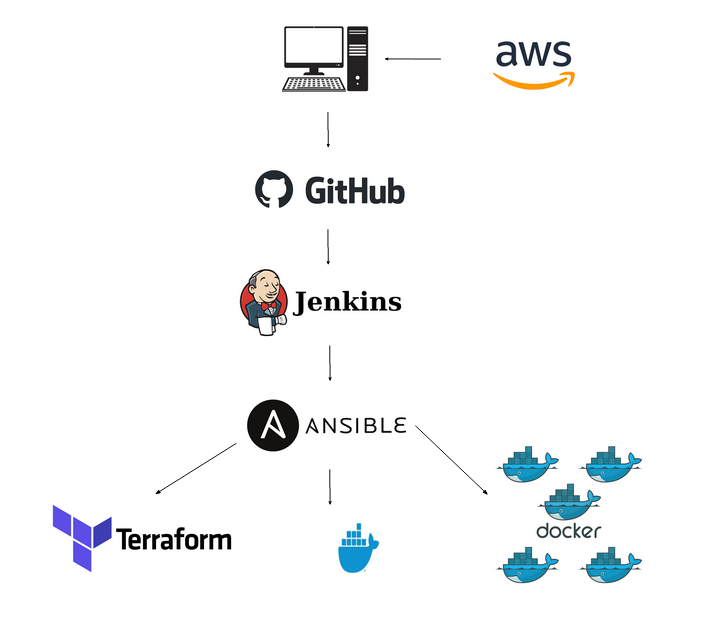
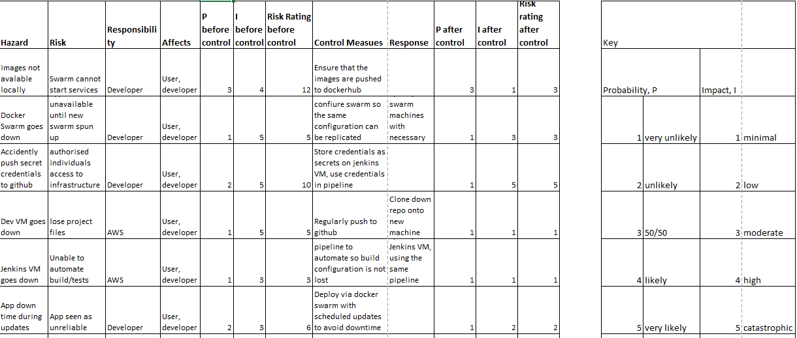

# DevOps - Final Project

## PLEASE NOTE THAT PROJECT IS INCOMPLETE
There's an issue in the config.yml file. I'd need to export the 2 needed terraform outputs (ec2 instance ip and the rds endpoint url) to a file, copy the file to the provisioned instance and "pull" the contents out of the file. It'd certainly be easier to use 2 files, might complete this when I get the chance.

## Introduction

The purpose of this project is to design and implement a solution for automating the development workflows and deployments of the **Spring Pet Clinic** application, using tools that encapsulates concepts of all core modules covered during the training. 

The Project involves:

* Agile & Project Management
* Databases & Cloud Fundamentals
* Programming & Testing Fundamentals
* Continuous Integration
* Infrastructure as Code & Configuration Management
* Containerisation & Orchestration
* Cloud Configuration and Management

## Scope 

We worked with these 2 externally developed applications:

* https://github.com/spring-petclinic/spring-petclinic-angular
* https://github.com/spring-petclinic/spring-petclinic-rest

The **spring-petclinic-angular** serves as a front-end client using _AngularJS_, whilst the **spring-petclinic-rest** serves as an _API_ using _Java_.

The applicaion should be deployed considering the following:
* Multiple Environment support - test new features on an environment before merging their changes to the main branch
* Automation - changes on the GitHub repository automatically build and deploy to testing and live environments
* Running costs: the cost to develop the application and how they can be improved

## Metrics/Performance Standards:

- Agile workflow
- Thorough project tracking
- Equal participation/contribution
- Justification for decisions

## Team Organization and Project Management 

Our team adopted an Agile approach to the project management, organizng the project into sprints, assigning scrum roles and providing a product a backlog. For project tracking we used a Trello board. Backlog Items were assigned story points, acceptance criteria and _MoSCoW_ prioritisation, and moved from project _backlog_, to _sprint_ backlog, to -doing_, _reviewing_ and then _done_ as the project progressed. 
At the begining, the state of the Trello board was:

During the project, we had to do a few changes to the deadline, as you can see below:

At the end, we were able to complete all the sprints and tasks:

The Trello board can be accessed [here](https://trello.com/b/LcCodeyy/group-project) 

## Tools Used 

This prject leans heavily on automated processes in the form of CI/CD, which models all parts of our integration workflow such as build, test, package and deploy stages. The majority of decisions were made based on familiarity and confidence with the tools, in order for us to be able to work efficiently.

- We used **VSCode** as a development environment to access a **Ubuntu** virtual machine hosted on AWS.

- Kanban: Project tracking was done using **Trello**. Some tasks were assigned story points, acceptance criteria and a MoSCoW prioritisation and moved through the stages from project backlog to Done as the project progressed.

- Version Control System (VCS): **Git** was used for version control and all memebers of the team had their repositories hoted on **GitHub**. Each developer created a different branch to isolate from the main version of the apllication. The main branch also contained a **development** to integrate the different branches code to test. The structure of the branches lokk as follow:
 

- Database: **MySQL** - We changed from an in-memory database to the AWS RDS database. 

- Continuous Integration / Continuous Deployment (CI/CD): **Jenkins**. This helps automate the parts of software development related to building, testing, and deploying, facilitating continuous integration and continuous delivery.
With the CI/CD pipeline configured and enabled, each developer completes the feature development and commits to the main integration branch and the CI/CD pipeline is triggered to perform each of the individual integration stages. 

- **Ansible** - Ansible was used to provision and configure the software required to successfully deploy the application through the pipeline.

- **Terraform** - Terraform is an IAC tool, used primarily by DevOps teams to automate various infrastructure tasks. The provisioning of cloud resources, for instance, is one of the main use cases of Terraform. It’s a cloud-agnostic, open-source provisioning tool written in the Go language and created by HashiCorp. It allows you to describe your complete infrastructure in the form of code. Even if your servers come from different providers such as AWS or Azure, Terraform helps you build and manage these resources in parallel across providers. Think of Terraform as connective tissue and common language that you can utilize to manage your entire IT stack.

- **AWS** cloud - We created and deployed our instances using AWS cloud provider. 

- Reverse Proxy: **NGINX** - A reverse proxy using NGINX was implemented, to listen to ports and performs a proxy pass, directing traffic to other applications. 

- Containerisation: **Docker** - Docker was used to containerize the Spring app to simplify and accelerate the workflow. The _Eclipse Temurin_ which has a built-in JDK was used to define the base image. The image's application code was stored in the _app_ directory. The instructions from the Maeven and pom.xml were copied from the host machine into the /app directory. We run the command to install the dependencies into the image. Then the source code was add into the image. At the end, we specify which command we want to run when the image is executed inside a container. 

- Orchestration Tool: **Docker Swarm** - (Definiton not sent by the developer)

Overall structure of the CI/CD pipeline:

## Risk Assessment 

During the project, a risk assessment was designed to evaluate potential scenarios that may impact the project in a negative way. This initial risk assessment is shown below:

However the risk assessment was not reviewed at the end of the projects. 

## Special Thanks to the following people:
Jac Adams and all from AMS who helped keeping our heads in the game.
Adam G, Leon R, Earl G, and all the trainers at QA
The folks at Deloitte, including Bence R and Richard N. Ye were great!
### And last but not least,
My fellow team members, who without ye I wouldn't have been able to get a successful deployment.

## Thanks folks
